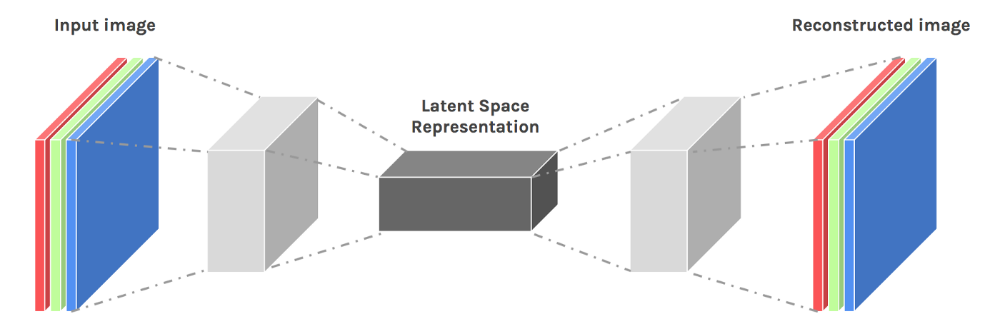
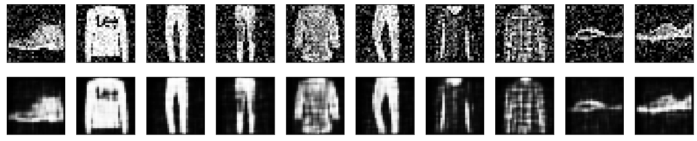

# AutoEncoders_Image_Denoising
Image Denoising using Auto-Encoders - Tensorflow

## So, what is an Autoencoder?

Autoencoders are a family of neural networks for which the input is the same as the output. They work by compressing the input into a latent-space representation and then reconstructing the output from this representation.

## Overview

In this project of mine, I have implemented an Autoencoder that'll be able to remove the noise present in the input image.

To simulate a dataset with noisy images, I have taken the FashionMNIST dataset and added noise to it artificially.
The target image is the same image without noise.

The network takes in the input image and learns the parameters in such a way that the output image generated will
be as noise-free as possible as the target image.

## Output

If you have any issues or doubts, feel free to ask them. I'll do my best to answer. :)

Happy Learning People ! Keep chasing your dreams ! ⭐️
